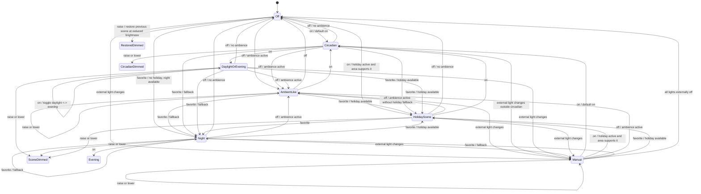
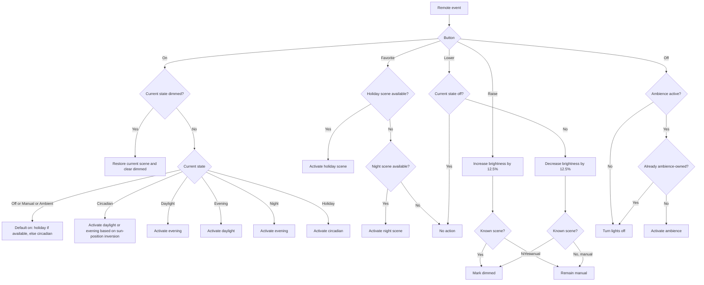
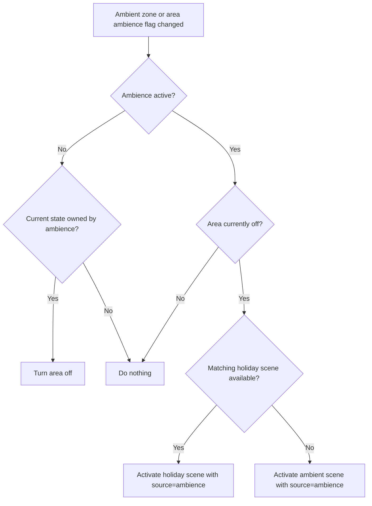
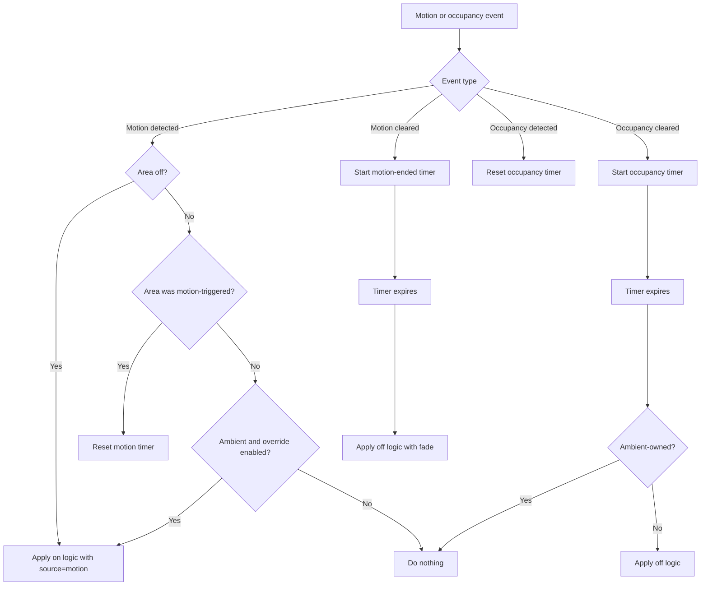

[](https://gitlab.idleengineers.com/aaron/home-assistant-area-lighting/-/pipelines)
[](https://hacs.xyz)

# Area Lighting

> The canonical source for this project is [gitlab.idleengineers.com/aaron/home-assistant-area-lighting](https://gitlab.idleengineers.com/aaron/home-assistant-area-lighting).
> The [GitHub repository](https://github.com/aarontc/home-assistant-area-lighting) is a read-only mirror that exists so HACS can install it. Please file issues and merge requests on GitLab.

`area_lighting` is a Home Assistant custom component for managing lights on a per-area basis.
Its purpose is to replace large collections of ad hoc automations, scripts, scenes, helpers, and
device-specific logic with one consistent behavioral model.

## Getting Started

### Installation via HACS

1. Open HACS in your Home Assistant instance.
2. Go to **Integrations** → **⋮** (top-right menu) → **Custom repositories**.
3. Add the repository URL (HACS only supports GitHub, so use the mirror):
   ```
   https://github.com/aarontc/home-assistant-area-lighting
   ```
4. Select **Integration** as the category and click **Add**.
5. Search for **Area Lighting** in HACS and click **Install**.
6. Restart Home Assistant.

### Manual Installation

Copy the `custom_components/area_lighting` directory into your Home Assistant
`config/custom_components/` directory and restart.

The component is event-driven. It reacts to four categories of inputs:

1. Remote control button presses
2. Ambient zone changes driven by time of day, sun position, or future built-in logic
3. Motion and occupancy sensor activity
4. External Home Assistant changes, including dashboards, scenes, and other integrations

The intent is not merely to remember "which scene is active", but to track why the area is in its
current condition so that later events can be handled correctly.

## Status legend

This README now serves two purposes:

1. Describe the intended behavior of the component
2. Mark which parts are already implemented in code and which are still target behavior

Status labels used below:

1. `Implemented` means the current code substantially does this now
2. `Partial` means the code does part of it, but important edge cases or details still differ
3. `Pending` means this is target behavior, not current behavior

## Design goals

The system is designed to:

1. Provide predictable 5-button remote behavior in every area
2. Expose a virtual circadian scene that delegates light updates to `circadian_lighting`
3. Support ambient lighting periods, including holiday-aware ambience
4. Support motion-triggered lighting and occupancy-based shutoff
5. Detect when something outside `area_lighting` changed the lights and fall back to `manual`
6. Preserve enough state across restarts to recover timers, ambience ownership, and scene context

## State model

Status: `Implemented`

Each area tracks three orthogonal pieces of state:

1. Primary state
   `off`, `scene`, `circadian`, or `manual`
2. Activation source
   `remote`, `motion`, `ambience`, `occupancy`, `holiday`, `scene activation`, `manual/external`
3. Modifiers
   whether the area is `dimmed`, and which scene should be restored when dimming is cleared

The important distinction is between the visual scene and the ownership of that scene.

Examples:

1. A holiday scene activated by ambience is still considered ambient behavior
2. The same holiday scene activated by the favorite button is user-owned behavior
3. A dimmed daylight scene is still fundamentally "daylight", not `manual`
4. External light changes move the area to `manual` because the component no longer knows the real scene intent

## High-level state machine

Status: `Implemented`

Notes:

1. The current code does implement primary state, source tracking, and dimmed restoration context
2. The exact transitions shown here are the target model, but some edges still differ in code
3. In particular, holiday/ambient fallback nuances and dimming-from-`off` behavior are not fully aligned yet



`AmbientLike` means either the literal `ambient` scene or a holiday scene that was activated because
ambience was active.

## Event sources

The easiest way to reason about the component is by event family rather than by raw state enum.

### 1. Remote controls

Status: `Implemented`

Each remote has five buttons:

1. `on`
2. `raise`
3. `favorite`
4. `lower`
5. `off`

#### `on`

Status: `Implemented`

`on` is the primary scene-cycling input.

Default behavior:

1. If a global holiday scene is enabled and the area has a matching scene, activate that holiday scene
2. Otherwise activate the virtual `circadian` scene

After the default scene is active:

1. If the current scene is dimmed, `on` restores that same scene and clears the dimmed flag
2. If the current scene is `circadian`, `on` toggles to a fixed scene based on sun position
3. If the current scene is `daylight`, `on` activates `evening`
4. If the current scene is `evening`, `on` activates `daylight`
5. If the current scene is `night`, `on` activates `evening`
6. If the current scene is a holiday scene, `on` activates `circadian`
7. From `ambient` or `manual`, `on` behaves the same as from `off`

The intent is to surface the most appropriate default first, then let repeated `on` presses swap
between useful working and relaxing scenes. `night` and holiday-special behavior are treated as
special-access modes rather than the main cycle.

Current code notes:

1. Default `holiday -> circadian` behavior is implemented
2. Dimmed-scene restoration is implemented
3. `circadian -> daylight/evening`, `daylight <-> evening`, `night -> evening`, and `holiday -> circadian` are implemented
4. The current code also allows `night_mode` to affect default `on` selection more broadly than this README describes

#### `raise`

Status: `Implemented`

`raise` always means "increase brightness without losing scene context".

Behavior:

1. From `off`, turn lights on using the most recent scene at 12.5% of configured brightness
2. From `ambient`, `circadian`, `daylight`, `evening`, `night`, or holiday scenes, increase brightness by 12.5%
3. From `circadian`, disengage circadian control before stepping brightness
4. From scene-based states other than `manual`, mark the area as `dimmed`
5. From `manual`, increase brightness but do not reinterpret the area as a known scene

`raise` does not enter `manual`. A dimmed scene is still a known scene with modified brightness.

Current code notes:

1. The code does brightness stepping without entering `manual`
2. The code marks known scenes as dimmed
3. The current step size is `20%`, not `12.5%`
4. From `off`, the current code does not restore the most recent scene at reduced brightness
5. The current code targets pre-defined dimming light groups directly rather than expressing this in scene-relative terms

#### `lower`

Status: `Implemented`

`lower` mirrors `raise`.

Behavior:

1. From `off`, no action is taken
2. From `ambient`, `circadian`, `daylight`, `evening`, `night`, or holiday scenes, decrease brightness by 12.5%
3. From `circadian`, disengage circadian control before stepping brightness
4. From scene-based states other than `manual`, mark the area as `dimmed`
5. From `manual`, decrease brightness but remain in `manual`

Current code notes:

1. The code does brightness stepping and dimmed tracking
2. The current step size is `20%`, not `12.5%`
3. From `off`, the current code does not explicitly no-op in the way described here

#### `favorite`

Status: `Implemented`

`favorite` is the shortcut into special scenes.

Behavior:

1. If a global holiday scene is configured and the area has a matching holiday scene, activate it
2. Otherwise, if the area supports `night`, activate `night`
3. Otherwise do nothing

Repeated favorite presses alternate between holiday and `night` where both are available.

#### `off`

Status: `Implemented`

`off` is context-sensitive.

Behavior:

1. If ambience is active for this area, `off` activates ambience
2. If the area is already in an ambience-owned state, `off` turns lights fully off
3. If ambience is not active, `off` turns lights fully off

Ambience is considered active only when both are true:

1. The area's `ambience_enabled` flag is on
2. The area's ambient zone boolean is on

Holiday nuance:

1. If `off` falls back into ambience from a normal scene, holiday ambience may be chosen if a matching holiday scene exists
2. If `off` is pressed while already in a holiday scene, the fallback is the literal `ambient` scene without holiday logic
3. If the area is already in an ambience-owned ambient state, the next `off` turns the lights off

Current code notes:

1. Ambience gating via both area flag and ambient zone is implemented
2. Falling back to ambience from normal scenes is implemented
3. Turning off from already-ambient states is implemented
4. The special-case rule "holiday scene -> literal ambient without holiday logic" is not implemented yet; current code turns fully off from holiday scenes

### Remote flow

Status: `Implemented`



### 2. Ambient zones

Status: `Implemented`

Ambient zones model the idea that some areas should have low-level lighting during certain periods.
Today those zone booleans are driven by existing Home Assistant automations. In the future that logic
may move into this component.

When an area's ambient zone becomes active:

1. Nothing happens unless the area's `ambience_enabled` flag is also on
2. If ambience is enabled and the area is currently `off`, ambience immediately activates
3. If the area is already on, ambience does not take over

When ambience activates:

1. If a global holiday scene is currently selected and the area has a matching holiday scene, activate that holiday scene
2. Otherwise activate the area's literal `ambient` scene
3. Record that the source of the current lighting state is `ambience`

When ambience deactivates:

1. If the current lighting state was activated by ambience, turn the area off
2. If the current scene merely happens to be `ambient` or a holiday scene for some other reason, do nothing

This ownership rule matters. A holiday scene triggered by the favorite button should remain on even if
ambience later turns off.

Current code notes:

1. Ambient activation only while the area is `off` is implemented
2. Ambience ownership tracking is implemented through activation source
3. Ambience deactivation only turns lights off when ambience originally activated them, which is implemented
4. The README describes future in-component ambient-zone scheduling logic; that is still pending
5. Holiday mode changes currently have extra side effects outside ambience alone: enabling holiday can turn on currently-off supported areas, and disabling holiday can turn off holiday-owned states entered via the holiday-change path

### Ambient flow

Status: `Implemented`



### 3. Motion and occupancy

Status: `Implemented`

Motion and occupancy serve different purposes.

Motion lighting:

1. Motion can turn lights on
2. When motion stops, a shorter timer begins
3. When that timer expires, lights are turned off as if `off` had been pressed, usually with a fade

Occupancy protection:

1. Any time any light in the area is on, an occupancy timer runs
2. Occupancy sensors reset that timer
3. When the timer expires, the area is turned off as if `off` had been pressed
4. This applies even if the area is in `manual`
5. Ambient-owned states are exempt from occupancy shutoff

#### Motion activation

Status: `Implemented`

Motion `on` is conceptually the same as pressing remote `on`, with two additions:

1. The activation source is recorded as `motion`
2. A later motion timeout can perform a fade-out path

Motion while an area is already on:

1. If the current state was triggered by motion, new motion resets the motion timer
2. If the current state was not triggered by motion, motion does nothing
3. Exception: if the area is in ambient mode and `motion_override_ambient` is true, motion may promote ambience into a normal active scene
4. If `motion_override_ambient` is false, motion is ignored while ambient is active

Night mode changes motion behavior:

1. Motion defaults to `night` instead of holiday-or-circadian
2. Motion and occupancy timers are generally shorter
3. Fade durations are shorter

Current code notes:

1. Motion activation currently reuses the same `on` logic as remote `on`, which is implemented
2. Motion override of ambient is implemented for literal `ambient`
3. Motion retrigger behavior is partially implemented through timer cancellation and re-entry into `lighting_on`
4. The current code does not distinguish all target cases exactly by source ownership
5. Night-mode-specific motion defaults are only partially reflected in current code

#### Timeout behavior

Status: `Implemented`

Motion stop:

1. Start the motion-ended timer
2. Future versions may add an intermediate dimming step before shutoff

Motion timer expiry:

1. Treat it like an `off` event with a fade
2. This means the result is either full off or ambience fallback, depending on ambient conditions

Occupancy cleared:

1. Start the occupancy timer

Occupancy timer expiry:

1. Treat it like an `off` event
2. This still applies in `manual`
3. This does not apply to ambient-owned states

Current code notes:

1. Motion-off and occupancy timers exist and both route into off/fade behavior
2. Ambient-like states are exempt from occupancy timeout in current code
3. Occupancy timeout still applies to `manual`, which is implemented
4. The broader target story around shorter night-mode timers and smarter dim-before-off behavior is still pending

### Motion and occupancy flow

Status: `Implemented`



### 4. External Home Assistant changes

Status: `Implemented`

`area_lighting` must coexist with the rest of Home Assistant, including dashboards, scripts, scenes,
and integrations that may directly manipulate lights.

#### Known scene activations

Status: `Implemented`

If a Home Assistant scene entity belonging to an area is activated from any source:

1. Track that scene as the area's current scene
2. Preserve enough context for later dimmed-scene restoration
3. Do not treat that scene as part of the normal `on` cycle unless it already belongs there

In other words, scene tracking is broader than button-cycle membership.

#### Manual light changes

Status: `Implemented`

If one or more individual lights are changed outside `area_lighting`, and the change did not come from
`circadian_lighting` while the area is in `circadian`, the area enters `manual`.

Manual changes include visible attribute changes such as:

1. Brightness
2. Color temperature
3. Other color attributes

This detection should use a hysteresis threshold so tiny changes or immediate writebacks do not
incorrectly force `manual`.

Current code notes:

1. External per-light changes can move the area into `manual`, which is implemented
2. The current heuristic is still simple and incomplete
3. A real scene-change grace period is not implemented yet
4. Circadian-originated light updates are not yet filtered with the full nuance described here

#### All lights externally turned off

Status: `Implemented`

If all lights in an area become off:

1. The area state becomes `off`
2. Motion and occupancy timers are canceled
3. Dimmed restore information is cleared

Current code notes:

1. Transitioning to `off` and clearing dimmed context is implemented
2. Circadian switches are disabled when all lights go off
3. Timer cancellation on this path is still pending

## State ownership and precedence

Status: `Implemented`

When multiple things could explain the current area condition, use this precedence order:

1. External light changes -> `manual`
2. Internal remote actions
3. Internal motion actions
4. Internal ambience actions
5. Internal occupancy actions

This means:

1. A remote press after motion-triggered lighting promotes the area into normal user-driven behavior
2. Manual external changes always break the component's certainty about the current scene
3. Occupancy shutoff is intentionally low-priority but still allowed to turn off `manual` states later

Current code notes:

1. The component effectively follows most of this precedence model
2. Some precedence is implicit in event handlers rather than centralized as a formal conflict-resolution system

## Persistence and restart behavior

Status: `Implemented`

The component should persist enough state to recover area behavior across Home Assistant restarts.

At minimum, persist:

1. Current primary state
2. Current scene slug
3. Activation source
4. Dimmed flag and previous scene
5. Area toggles such as ambience enabled, motion enabled, override ambient, night mode
6. Timer-related information needed to reconstruct pending shutoff behavior

After restart, the component should:

1. Restore known area state as accurately as possible
2. Re-evaluate whether ambience should now be active or inactive
3. Handle timers that would have expired while Home Assistant was offline
4. Continue treating ambience-owned scenes differently from user-owned scenes

Current code notes:

1. Core area state and several toggles are already persisted
2. Full timer reconstruction across restart is not implemented yet
3. Replaying or reconciling events that occurred while Home Assistant was offline is still pending

## Rules summary

Status: `Implemented`

The shortest useful summary of the intended behavior is:

1. Remote `on` chooses the best default scene first, then cycles between useful active scenes
2. `favorite` is for special modes like holiday and `night`
3. `raise` and `lower` adjust brightness without losing scene identity
4. Ambient behavior depends on ownership, not just the visible scene name
5. Motion behaves like `on`, but with timeout ownership and fade-out handling
6. Occupancy is a long-running safety net and still applies to `manual`
7. External light changes break scene certainty and move the area to `manual`
8. Persistence matters because restart recovery changes later off/ambient decisions

## Configuration concepts

An area configuration generally needs to define:

1. The area identity and light group
2. The scene slugs available for that area
3. The lights and any circadian switch bindings
4. Optional holiday scenes
5. Optional ambient scene and ambient zone membership
6. Optional motion and occupancy sensors
7. Optional remote devices and their additional actions
8. Optional timer durations (normal and night-mode overrides)
9. Optional `brightness_step_pct` per-area override (default 12)
10. Optional `night_fadeout_seconds` per-area override

This README intentionally describes behavior first. The exact YAML or storage format can evolve as long
as these behavioral guarantees remain true.

## Required external entities

`area_lighting` does not create any of these — they must exist in your Home
Assistant instance before the integration loads. On startup, the integration
logs a single error listing any that are missing; it then continues to load
in degraded mode (motion lighting may behave oddly if globals are missing,
holiday detection is disabled, etc.).

### Global

| Entity | Type | Purpose | Required values |
|---|---|---|---|
| `input_select.holiday_mode` | input_select | Active holiday | `none`, `christmas`, `halloween` |
| `input_select.ambient_scene` | input_select | Ambient flavor toggle | `ambient`, `holiday` |
| `input_boolean.lighting_circadian_daylight_lights_enabled` | input_boolean | Sun-position proxy used by `circadian` cycling | on / off |
| `input_boolean.motion_light_enabled` | input_boolean | Global motion-lighting kill switch | on / off |
| `sensor.circadian_values` | sensor | From `circadian_lighting` integration | must expose `colortemp` attribute |

### Per ambient zone

For every distinct value of `ambient_lighting_zone` referenced by any enabled area:

| Entity | Type | Purpose |
|---|---|---|
| `input_boolean.lighting_{zone}_ambient` | input_boolean | Ambient zone toggle (e.g., `input_boolean.lighting_upstairs_ambient`) |

### Per area

| Entity | Type | Purpose |
|---|---|---|
| `switch.circadian_lighting_{area_name}_{switch_name}_circadian` | switch | One per circadian switch defined for the area |
| `light.{area_id}_lights` (optional) | light group | If present, used for fast all-off detection. If absent, the integration aggregates the area's individual lights instead. |

### Required integrations

| Integration | Source | Why |
|---|---|---|
| `circadian_lighting` | HACS | Provides `sensor.circadian_values` and per-area circadian switches |
| `lutron_caseta` | HA core | Provides `lutron_caseta_button_event` (only if Pico remotes are used) |

### Example bootstrap

```yaml
input_select:
  holiday_mode:
    name: Holiday Mode
    options: [none, christmas, halloween]
    initial: none
    icon: mdi:party-popper
  ambient_scene:
    name: Ambient Scene
    options: [ambient, holiday]
    initial: ambient

input_boolean:
  lighting_circadian_daylight_lights_enabled:
    name: Circadian Daylight Lights Enabled
  motion_light_enabled:
    name: Motion Lighting (Global)
    initial: true
  lighting_upstairs_ambient:
    name: Upstairs Ambient Zone
  lighting_downstairs_ambient:
    name: Downstairs Ambient Zone
```

## Stretch goals

Items not in scope for the current implementation but tracked for future
work:

1. **Role-based dimming targets.** `raise`/`lower` currently dims every
   light that's on in the area. A future version should honor a `dimming`
   role on `LightConfig` so a TV-room raise leaves the accent lights
   alone. Role-based targeting for dimming was present in earlier versions
   and was removed in favor of "lights currently on" as the simpler
   baseline.
2. **Follow-area scene mirroring.** Allow one area to track another
   area's current scene (e.g., kitchen follows living room when the
   kitchen is off and the living room turns on). Earlier code had a
   partial implementation; removed pending a cleaner design.
3. **Light followers.** Configurable leader/follower light pairs for
   situations like "fan light tracks ceiling light." Removed pending a
   clearer use case.
4. **Standalone scene-YAML conversion script.** A helper (in `scripts/`,
   not inside the component) that reads templater-generated
   `scenes/templater/*.yaml` files and produces an `area_lighting`
   configuration block, so existing deployments can migrate their
   snapshot data without losing it.
5. **In-component ambient zone scheduling.** Currently the
   `input_boolean.lighting_{zone}_ambient` toggles are driven by external
   automations. The component could own this with a per-zone schedule
   (sun-based, time-based, manual override).
6. **Intermediate dim-before-off motion fade.** Step the brightness down
   in two stages so the user has time to notice and re-trigger motion
   before the room goes fully dark.
7. **ConfigEntry-based integration.** Convert from YAML-only setup to
   a ConfigFlow-based integration. This would let the component register
   a proper HA "device" per area, so Settings → Devices → <Area> →
   Create dashboard produces a complete Lovelace card automatically.
   Today entities are grouped via HA *areas* (Settings → Areas), which
   also supports dashboard auto-generation but is a different UX path.

## Testing

The component has two test layers:

- **Pure unit tests** — no HA dependency, fast. Cover `scene_machine`,
  `area_state`, and `timer_manager`. Located directly under
  `custom_components/area_lighting/tests/`.
- **Integration tests** — run against a real HA instance via
  `pytest-homeassistant-custom-component`. Cover controller behavior,
  event handlers, persistence, validation, and edge cases. Located
  under `custom_components/area_lighting/tests/integration/`.

To run everything from inside the component directory:

```bash
cd custom_components/area_lighting
uv sync --extra dev
uv run pytest -n auto
```

`-n auto` runs tests in parallel via `pytest-xdist`. The component
pins `python 3.13` via `.python-version` because newer Python versions
may not have compatible `pytest-homeassistant-custom-component` releases.

If tests fail with import errors from `homeassistant.*`, bump
`pytest-homeassistant-custom-component` in `pyproject.toml` to match
your HA core version and re-run `uv sync --extra dev`.
